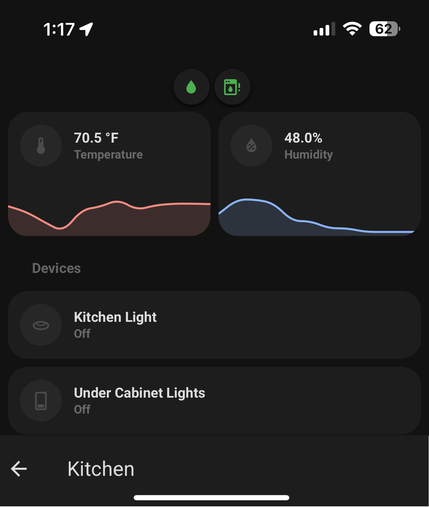
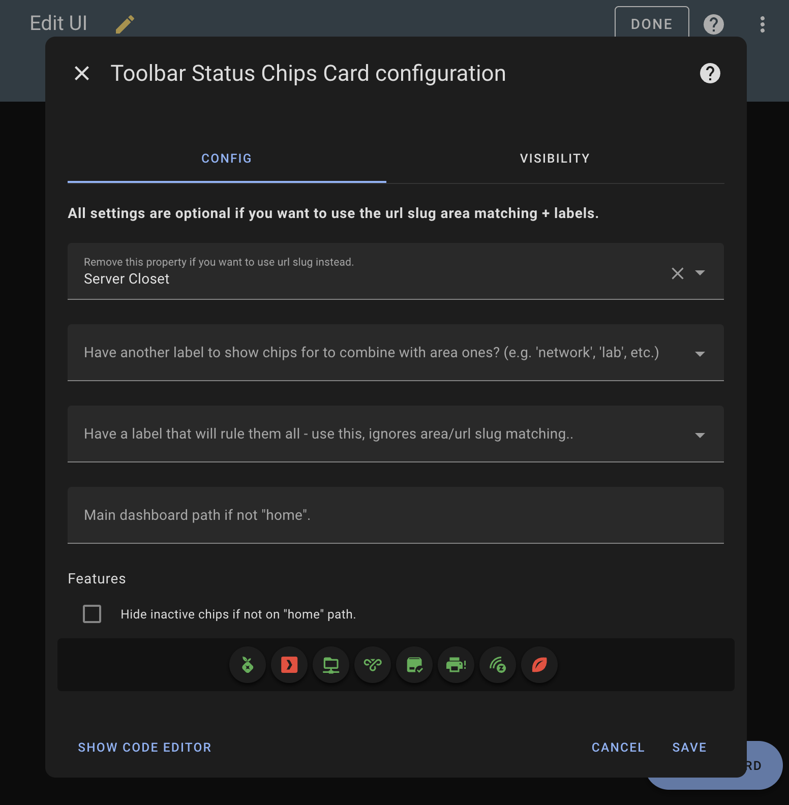

<p align="center">
    
</p>
<p align="center"><h1 align="center">TOOLBAR-STATUS-CHIPS</h1></p>
<p align="center">
	<em>Status at a glance, always.</em>
</p>


[](https://github.com/hacs/integration)


<p align="center">Built with the tools and technologies:</p>
<p align="center">
	
	
	
	
	
</p>
<br>

## Overview

A custom card for Home Assistant that displays status chips in the toolbar for entities labeled with "status". The chips automatically update based on entity states and are positioned at the top of your dashboard.

This card is slightly opinionated in how you need to setup things for it to work. Feel free to make a PR if you need more flexibility.

|  |
| :--------------------------------------------: |
|    _Roll-up all status chips on home page_     |

|      |
| :---------------------------------------: |
| _Have status chips by area automatically_ |

|                  |
| :-----------------------------------------------------------: |
| _Mobile will add a padding automatically for bottom nav use._ |

## Features

- Displays entity states as chips in the toolbar
- Automatically filters entities with the "status" label
- Area-aware filtering based on the current url matching the area
- Mobile-responsive with automatic margin adjustments
- Real-time updates when entity states change
- Works with these type of entities
  - `binary_sensor`
  - `sensor` which returns a count
  - any sensor if you customize the `on_state` attribute of it

## Installation

### Prerequisites

> [!WARNING]  
> Before using this card, please ensure you have the [button-card](https://github.com/custom-cards/button-card) custom component installed in your Home Assistant instance.

### HACS (Recommended)

1. Open HACS in your Home Assistant instance
2. Click the menu icon in the top right and select "Custom repositories"
3. Add this repository URL and select "Dashboard" as the category
   - `https://github.com/homeassistant-extras/toolbar-status-chips`
4. Click "Install"

### Manual Installation

1. Download the `toolbar-status-chips.js` file from the latest release in the Releases tab.
2. Copy it to your `www/community/toolbar-status-chips/` folder
3. Add the following to your `configuration.yaml` (or add as a resource in dashboards menu)

```yaml
lovelace:
  resources:
    - url: /local/community/toolbar-status-chips/toolbar-status-chips.js
      type: module
```

## Configuration

### Card Configuration

#### Main Status Route

> [!IMPORTANT]  
> The main route shows all your status chips that are 'active'. This is the place to see all issues at once.

Add the card to your Lovelace dashboard using YAML:

```yaml
type: custom:toolbar-status-chips
```

This assumes your main page you want to show chips on is on the path `home`. i.e. my home page is http://homeassistant.local:8123/the-matrix/home

For example, see my HA configuration for my dashboard home page: [01-home.yaml](https://github.com/warmfire540/home-assistant-config-public/blob/home/ui_lovelace_minimalist/dashboard/views/01-home.yaml)

```yaml
title: Home
path: home
cards:
  - type: custom:toolbar-status-chips
```

If your status or home page isn't on the path `home`, you can use the following config to override the page it's on.

```yaml
type: custom:toolbar-status-chips
status_path: status-page # or w/e your url is
```

#### Area View Status Chips

> [!IMPORTANT]  
> Using this setting requires 2 labels.

If you have pages in your dashboard that correspond to areas, automatically the status chips will be displayed for that area. i.e. my room views are like

- http://homeassistant.local:8123/the-matrix/living-room
- http://homeassistant.local:8123/the-matrix/dining-room

And my status entities are in these areas with the same id.

> [!NOTE]  
> For area related status chips they are always shown.

Add the card to your Lovelace area view using YAML:

```yaml
type: custom:toolbar-status-chips
```

For example, see my HA configuration for my dashboard room header card that's used on all my room routes: [room_header.yaml](https://github.com/warmfire540/home-assistant-config-public/blob/home/ui_lovelace_minimalist/custom_cards/layout/room_header.yaml)

```yaml
title: Living Room
path: living-room
cards:
  - type: custom:toolbar-status-chips
```

#### Using `additional_label` property

Use this if you have a view that you want to combine some status entities on, that aren't related to an area. Using this will ignore the url slug.

```yaml
type: custom:toolbar-status-chips
additional_label: cats
```

Entities will have to have 2 labels for this (see below screenshot)

- Status
- Cats

#### Using `solo_label` property

Use this if you just want to show all chips given some label. Doesn't care if it contains a 'Status' label.

```yaml
type: custom:toolbar-status-chips
solo_label: lights
```

#### Using `area` property

Use this if you have non standard matching room views and areas. You can have any area show on any route with this.

```yaml
type: custom:toolbar-status-chips
area: yard
```

### Entity Configuration

#### Standard Configuration

1. Label your entities with "Status" in Home Assistant. Also set areas for them that corresponde to "rooms" in your dashboard.

|  |
| :----------------------------------------: |
|  _Status Labels and Areas set on entites_  |

2. Entities can specify their active state using the `on_state` attribute (defaults to "on").
3. Entities can specify a place to navigate to using the `navigation_path` attribute (defaults to "more-info" on click)
4. Entities can specify their active color using the `on_color` attribute (defaults to "red").
5. Entities with numeric state can specify a pass/warning threshold to show three colors using `numeric_state_pass_threshold` and `numeric_state_warning_threshold`
   - this is useful for entities where a numeric state is good and actually counts down (like a filter or battery %).

You can customize entity attributes several ways.

For entities you don't control, use [customizations](https://www.home-assistant.io/docs/configuration/customizing-devices/).

```yaml
customize:
  sensor.mfc_7860dw_status:
    on_state: 'unavailable'

  binary_sensor.rolo_error:
    navigation_path: /the-matrix/living-room

  binary_sensor.poat_hole_local:
    navigation_path: /the-matrix/pi-hole

  counter.homeassistant_warnings:
    on_color: yellow
```

For entities you template, just set the attributes then.

```yaml
sensor:
  - name: Printer Left On
    unique_id: b4081d9f-24f3-4083-9fa6-70c30a432c26
    state: "{{ not is_state('sensor.mfc_7860dw_page_counter', 'unavailable') and (now() - states.sensor.mfc_7860dw_page_counter.last_updated) > timedelta(minutes=5) }}"
    icon: mdi:printer-alert
    attributes:
      navigation_path: /the-matrix/network?anchor=updates
      on_state: 'True'
```

#### Numeric State Entities

Normally when an entity has a numeeric state, the chip is 'active' and will be red. This is useful for entities like "count of offline devices" or "home assistant error count".

However, for ones that count down like filter or battery % - you can use additional properties `numeric_state_pass_threshold` and `numeric_state_warning_threshold`.

Here's an example of my entity customization:

```yaml
sensor.cat_noms_desiccant_days_remaining:
  navigation_path: /the-matrix/cats
  numeric_state_pass_threshold: 10
  numeric_state_warning_threshold: 5

sensor.pet_thirst_filter:
  navigation_path: /the-matrix/cats
  numeric_state_pass_threshold: 30
  numeric_state_warning_threshold: 10
```

`sensor.pet_thirst_filter` chip will be green when it's above 30, it will be yellow when bove 10, otherwise it will be red (or `on_color`)

## Usage


Add the card to your dashboard using the UI editor or YAML:

### Card Editor

This card is fully configurable in the card editor, however if setup right you don't need to setup any of these options.



### YAML

This is the most minimal configuarion needed to get started. See below for advanced usage.

```yaml
type: custom:toolbar-status-chips
```

The card will automatically:

- Display chips for any entity labeled with "status" that is in an active state
- Filter entities based on the current area if viewing an area dashboard
- Update in real-time as entity states change
- Adjust layout for mobile viewing

## Options

### Card Configuration

| Name             | Type   | Default   | Description                                                                              |
| ---------------- | ------ | --------- | ---------------------------------------------------------------------------------------- |
| status_path      | string | "home"    | The path identifier for the home view. These show all "problem" chips across all areas.  |
| additional_label | string | null      | This is useful if you want to roll-up entities in a non area view, using a second label. |
| solo_label       | string | null      | Use this option to override having a status label or areas.                              |
| area             | string | null      | Use this option to override using the url slug.                                          |
| features         | list   | See below | Optional flags to toggle different features                                              |

### Feature Options

| Name     | Type | Description                                                  |
| -------- | ---- | ------------------------------------------------------------ |
| optional | flag | Hides chips that are not active (automatic on `status_path`) |

### Entity Configuration

| Name                            | Type    | Default            | Description                                                              |
| ------------------------------- | ------- | ------------------ | ------------------------------------------------------------------------ |
| exclude_on_status_path          | boolean | false              | Use this option to hide entities from the main status page always.       |
| numeric_state_pass_threshold    | number  | null               | The threshold value to determine a passing state for numeric entities.   |
| numeric_state_warning_threshold | number  | 0null              | The threshold value to determine a warning state for numeric entities.   |
| on_color                        | string  | 'var(--red-color)' | The color representing the active or on state.                           |
| on_state                        | string  | 'on'               | The string value representing the active or on state.                    |
| navigation_path                 | string  | null               | The path identifier for the navigation view. Uses 'more-info' by default |

## Troubleshooting

Common issues and solutions:

1. **Chips not appearing:**

   - Verify entities have the "status" label
   - Check entity states match their `on_state` attribute or `on`
   - Ensure the card is properly loaded in resources

2. **Mobile layout issues:**
   - Clear browser cache
   - Refresh the page
   - Check for conflicts with other custom cards

## Project Roadmap

- [x] **`Initial design`**: <strike>create initial room card based on button-card template in UI minimialist theme.</strike>
- [x] **`Card Editor`**: <strike>ability to use the HA card editor.</strike>
- [ ] **`Test on other themes`**: make sure it works elsewhere.
- [ ] **`No button card`**: remove reliance on other cards.

## Contributing

- **💬 [Join the Discussions](https://github.com/homeassistant-extras/toolbar-status-chips/discussions)**: Share your insights, provide feedback, or ask questions.
- **🐛 [Report Issues](https://github.com/homeassistant-extras/toolbar-status-chips/issues)**: Submit bugs found or log feature requests for the `toolbar-status-chips` project.
- **💡 [Submit Pull Requests](https://github.com/homeassistant-extras/toolbar-status-chips/blob/main/CONTRIBUTING.md)**: Review open PRs, and submit your own PRs.

<details closed>
<summary>Contributing Guidelines</summary>

1. **Fork the Repository**: Start by forking the project repository to your github account.
2. **Clone Locally**: Clone the forked repository to your local machine using a git client.
   ```sh
   git clone https://github.com/homeassistant-extras/toolbar-status-chips
   ```
3. **Create a New Branch**: Always work on a new branch, giving it a descriptive name.
   ```sh
   git checkout -b new-feature-x
   ```
4. **Make Your Changes**: Develop and test your changes locally.
5. **Commit Your Changes**: Commit with a clear message describing your updates.
   ```sh
   git commit -m 'Implemented new feature x.'
   ```
6. **Push to github**: Push the changes to your forked repository.
   ```sh
   git push origin new-feature-x
   ```
7. **Submit a Pull Request**: Create a PR against the original project repository. Clearly describe the changes and their motivations.
8. **Review**: Once your PR is reviewed and approved, it will be merged into the main branch. Congratulations on your contribution!
</details>

## License

This project is protected under the MIT License. For more details, refer to the [LICENSE](LICENSE) file.

## Acknowledgments

- Built using [LitElement](https://lit.dev/)
- Inspired by Home Assistant's chip design
- Button-Card was a huge inspo
- Thanks to all contributors!

[](https://github.com{/homeassistant-extras/toolbar-status-chips/}graphs/contributors)

## Build Status

### Main

[](https://github.com/homeassistant-extras/toolbar-status-chips/actions/workflows/push.yml)
[](https://github.com/homeassistant-extras/toolbar-status-chips/actions/workflows/pull_request.yaml)

### Release

[](https://github.com/homeassistant-extras/toolbar-status-chips/actions/workflows/push.yml)
[](https://github.com/homeassistant-extras/toolbar-status-chips/actions/workflows/merge.yaml)
