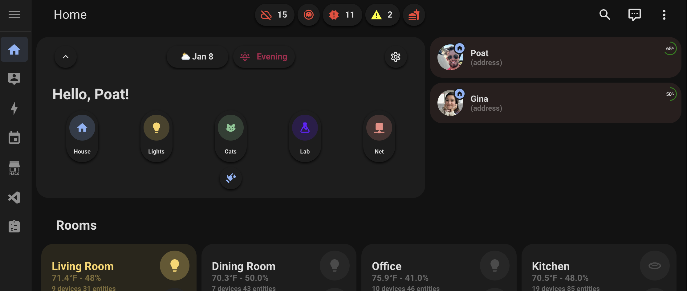
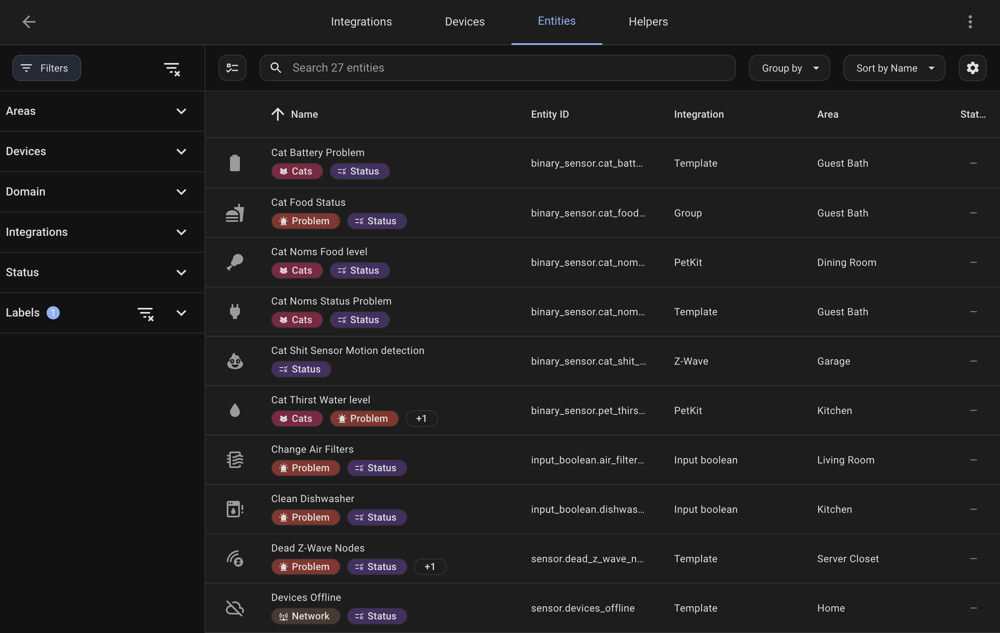

# Toolbar Status Chips Card


[](https://github.com/hacs/integration)


A custom card for Home Assistant that displays status chips in the toolbar for entities labeled with "status". The chips automatically update based on entity states and are positioned at the top of your dashboard.

This card is slightly opinionated in how you need to setup things for it to work. Feel free to make a PR if you need more flexibility.

|  |
| :--------------------------------------------: |
|    _Roll-up all status chips on home page_     |

|      |
| :---------------------------------------: |
| _Have status chips by area automatically_ |

|                  |
| :-----------------------------------------------------------: |
| _Mobile will add a padding automatically for bottom nav use._ |

## Features

- Displays entity states as chips in the toolbar
- Automatically filters entities with the "status" label
- Area-aware filtering based on the current url matching the area
- Mobile-responsive with automatic margin adjustments
- Real-time updates when entity states change
- Works with these type of entities
  - `binary_sensor`
  - `sensor` which returns a count
  - any sensor if you customize the `on_state` attribute of it

## Installation

### Prerequisites

> [!WARNING]  
> Before using this card, please ensure you have the [button-card](https://github.com/custom-cards/button-card) custom component installed in your Home Assistant instance.

### HACS (Recommended)

1. Open HACS in your Home Assistant instance
2. Click the menu icon in the top right and select "Custom repositories"
3. Add this repository URL and select "Dashboard" as the category
   - `https://github.com/warmfire540/toolbar-status-chips`
4. Click "Install"

### Manual Installation

1. Download the `toolbar-status-chips.js` file from the latest release or `dist/` folder
2. Copy it to your `www/community/toolbar-status-chips/` folder
3. Add the following to your `configuration.yaml`:

```yaml
lovelace:
  resources:
    - url: /local/community/toolbar-status-chips/toolbar-status-chips.js
      type: module
```

## Configuration

### Card Configuration

#### Main Status Route

> [!IMPORTANT]  
> The main route shows all your status chips that are 'active'. This is the place to see all issues at once.

Add the card to your Lovelace dashboard using YAML:

```yaml
type: custom:toolbar-status-chips
```

This assumes your main page you want to show chips on is on the path `home`. i.e. my home page is http://homeassistant.local:8123/the-matrix/home

For example, see my HA configuration for my dashboard home page: [01-home.yaml](https://github.com/warmfire540/home-assistant-config-public/blob/home/ui_lovelace_minimalist/dashboard/views/01-home.yaml)

```yaml
title: Home
path: home
cards:
  - type: custom:toolbar-status-chips
```

If your status or home page isn't on the path `home`, you can use the following config to override the page it's on.

```yaml
type: custom:toolbar-status-chips
status_path: status-page # or w/e your url is
```

#### Area View Status Chips

> [!IMPORTANT]  
> Using this setting requires 2 labels.

If you have pages in your dashboard that correspond to areas, automatically the status chips will be displayed for that area. i.e. my room views are like

- http://homeassistant.local:8123/the-matrix/living-room
- http://homeassistant.local:8123/the-matrix/dining-room

And my status entities are in these areas with the same id.

> [!NOTE]  
> For area related status chips they are always shown.

Add the card to your Lovelace area view using YAML:

```yaml
type: custom:toolbar-status-chips
```

For example, see my HA configuration for my dashboard room header card that's used on all my room routes: [room_header.yaml](https://github.com/warmfire540/home-assistant-config-public/blob/home/ui_lovelace_minimalist/custom_cards/layout/room_header.yaml)

```yaml
title: Living Room
path: living-room
cards:
  - type: custom:toolbar-status-chips
```

#### Using `additional_label` property

Use this if you have a view that you want to combine some status entities on, that aren't related to an area. Using this will ignore the url slug.

```yaml
type: custom:toolbar-status-chips
additional_label: cats
```

Entities will have to have 2 labels for this (see below screenshot)

- Status
- Cats

#### Using `solo_label` property

Use this if you just want to show all chips given some label. Doesn't care if it contains a 'Status' label.

```yaml
type: custom:toolbar-status-chips
solo_label: lights
```

#### Using `area` property

Use this if you have non standard matching room views and areas. You can have any area show on any route with this.

```yaml
type: custom:toolbar-status-chips
area: yard
```

### Entity Configuration

1. Label your entities with "Status" in Home Assistant. Also set areas for them that corresponde to "rooms" in your dashboard.

|  |
| :----------------------------------------: |
|  _Status Labels and Areas set on entites_  |

2. Entities can specify their active state using the `on_state` attribute (defaults to "on").
3. Entities can specify a place to navigate to using the `navigation_path` attribute (defaults to "more-info" on click)
4. Entities can specify their active color using the `on_color` attribute (defaults to "red").

You can customize entity attributes several ways.

For entities you don't control, use [customizations](https://www.home-assistant.io/docs/configuration/customizing-devices/).

```yaml
customize:
  sensor.mfc_7860dw_status:
    on_state: "unavailable"

  binary_sensor.rolo_error:
    navigation_path: /the-matrix/living-room

  binary_sensor.poat_hole_local:
    navigation_path: /the-matrix/pi-hole

  counter.homeassistant_warnings:
    on_color: yellow
```

For entities you template, just set the attributes then.

```yaml
sensor:
  - name: Printer Left On
    unique_id: b4081d9f-24f3-4083-9fa6-70c30a432c26
    state: "{{ not is_state('sensor.mfc_7860dw_page_counter', 'unavailable') and (now() - states.sensor.mfc_7860dw_page_counter.last_updated) > timedelta(minutes=5) }}"
    icon: mdi:printer-alert
    attributes:
      navigation_path: /the-matrix/network?anchor=updates
      on_state: "True"
```

## Usage

The card will automatically:

- Display chips for any entity labeled with "status" that is in an active state
- Filter entities based on the current area if viewing an area dashboard
- Update in real-time as entity states change
- Adjust layout for mobile viewing

## Options

| Name             | Type    | Default                     | Description                                                                              |
| ---------------- | ------- | --------------------------- | ---------------------------------------------------------------------------------------- |
| status_path      | string  | "home"                      | The path identifier for the home view. These show all "problem" chips across all areas.  |
| optional         | boolean | `true` on the `status_path` | Hides chips that are not active.                                                         |
| additional_label | string  | null                        | This is useful if you want to roll-up entities in a non area view, using a second label. |
| solo_label       | string  | null                        | Use this option to override having a status label or areas.                              |
| area             | string  | null                        | Use this option to override using the url slug.                                          |

## Troubleshooting

Common issues and solutions:

1. **Chips not appearing:**

   - Verify entities have the "status" label
   - Check entity states match their `on_state` attribute or `on`
   - Ensure the card is properly loaded in resources

2. **Mobile layout issues:**
   - Clear browser cache
   - Refresh the page
   - Check for conflicts with other custom cards

## Contributing

This project follows the standard GitHub workflow:

1. Fork the repository
2. Create a feature branch
3. Submit a Pull Request

## Support

- [Report a bug][issues]
- [Request a feature][issues]
- [Ask for help in HA Community][forum]

## License

MIT License - see the [LICENSE](LICENSE) file for details

## Acknowledgments

- Built using [LitElement](https://lit.dev/)
- Inspired by Home Assistant's chip design
- Thanks to all contributors!

[releases-shield]: https://img.shields.io/github/release/custom-cards/toolbar-status-chips.svg
[releases]: https://github.com/custom-cards/toolbar-status-chips/releases
[license-shield]: https://img.shields.io/github/license/custom-cards/toolbar-status-chips.svg
[issues]: https://github.com/custom-cards/toolbar-status-chips/issues
[forum]: https://community.home-assistant.io/
